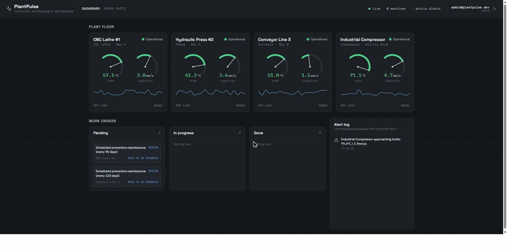

# PlantPulse

🇬🇧 [English](README.md) · 🇪🇸 Español

**Un CMMS con monitorización IoT en tiempo real — pensado para demostrar que sé construir un sistema full-stack real, no solo un CRUD.**


**[▶ Demo en vivo](https://alex18prog.github.io/plantpulse/)** · usuario: `admin@plantpulse.dev` / `admin123`
*(backend en un plan gratuito — la primera carga puede tardar hasta ~1 min en despertar; la propia app muestra un mensaje de "despertando" y reintenta automáticamente — ver [Limitaciones conocidas](#limitaciones-conocidas))*



## Qué es esto

La mayoría de portfolios junior muestran una lista de tareas o una tienda online. PlantPulse es software de mantenimiento industrial (un CMMS) — el tipo de herramienta interna que usa una fábrica real — con una capa de telemetría en vivo encima: sensores simulados transmiten datos por WebSocket, y el sistema **reacciona por sí solo**. Cuando una lectura se sale de rango, genera una alerta y abre una orden de trabajo correctiva de forma automática, sin ningún humano de por medio.

- 🔧 **Un dominio real** — activos, técnicos, repuestos, órdenes de trabajo preventivas/correctivas: un sistema que cualquier responsable de planta reconoce al instante, no un CRUD inventado.
- 📡 **De verdad en vivo** — telemetría por WebSocket, alertas y órdenes de trabajo generadas automáticamente. Causa y efecto que se puede ver ocurrir en 20 segundos, no una captura estática.
- 🔐 **Con forma de producción** — autenticación JWT con dos roles, CORS conectado correctamente a nivel de Spring Security (no solo un `WebMvcConfigurer` que en la práctica no hace nada), documentación Swagger, Docker Compose, CI en GitHub Actions, y un despliegue real repartido en tres servicios distintos de nivel gratuito (GitHub Pages + Render + Neon) conectados entre sí de verdad.
- 🧪 **Testeado, no solo "funciona"** — JUnit/Mockito en el backend, Playwright de extremo a extremo en el frontend, verificado con petición cross-origin real en producción, no solo en local.

## Enlaces rápidos
- 🚀 [Demo en vivo](https://alex18prog.github.io/plantpulse/)
- 📖 [Arquitectura y puesta en marcha](#arquitectura) — más abajo
- 🗺️ [Roadmap](#roadmap) — construido fase a fase, con un historial de commits limpio
- ⚠️ [Limitaciones conocidas](#limitaciones-conocidas) — la lista honesta, sin esconder nada

---

## Arquitectura

```
┌─────────────────────────┐
│ TelemetrySimulator │ @Scheduled cada 3s
│ (simula los sensores) │
└─────────────┬────────────┘
│ perturba las lecturas base
▼
┌───────────────────────────────────────────────────┐
│ Backend Spring Boot │
│ │
│ API REST (/api/**) WebSocket (STOMP) │
│ ─ Machines /topic/telemetry │
│ ─ Technicians /topic/alerts │
│ ─ Spare parts │
│ ─ Work orders ──▶ umbral superado ──▶ │
│ ─ Alerts Alert + WorkOrder auto │
│ │
│ H2 (dev) / PostgreSQL (prod) │
└───────────────────────────┬─────────────────────────┘
│ REST + STOMP sobre SockJS
▼
┌───────────────────────────────────────────────────┐
│ Frontend React + TypeScript │
│ │
│ Dashboard: tarjetas de máquina (gauges + sparkline)│
│ Log de alertas: feed en vivo de umbrales superados │
│ Work orders: tablero de 3 columnas (Pend/Prog/Fin) │
└───────────────────────────────────────────────────┘
```

### Backend — `backend/`

| Paquete | Responsabilidad |
|---|---|
| `domain` | Entidades JPA: `Machine`, `Technician`, `SparePart`, `WorkOrder`, `Alert` |
| `domain.enums` | `MachineStatus`, `WorkOrderStatus`, `WorkOrderType`, `Priority`, `AlertSeverity`, `TechnicianStatus` |
| `repository` | Repositorios de Spring Data JPA |
| `service` | `WorkOrderService` — transiciones de estado, creación automática de correctivas |
| `scheduler` | `TelemetrySimulatorService` — el corazón de toda la app |
| `controller` | Controladores REST bajo `/api/**` |
| `config` | `WebSocketConfig` (STOMP), `WebConfig` (CORS), `DemoDataSeeder` (datos de arranque) |
| `dto` | `TelemetryMessage`, `AlertMessage` — payloads del WebSocket |

Stack: Java 21, Spring Boot 3.3, Spring Data JPA, Spring WebSocket, Lombok,
H2 (dev) / PostgreSQL (prod), Maven.

### Frontend — `frontend/`

| Ruta | Responsabilidad |
|---|---|
| `lib/api.ts` | Wrapper tipado de fetch para la API REST |
| `lib/useRealtime.ts` | Hook de STOMP/SockJS — streams de telemetría y alertas |
| `components/GaugeDial.tsx` | Gauge radial estilo analógico (elemento visual de firma) |
| `components/MachineCard.tsx` | Panel por máquina: gauges, sparkline, LED de estado |
| `components/AlertsFeed.tsx` | Log de alertas en vivo |
| `components/WorkOrdersBoard.tsx` | Tablero de órdenes de trabajo de 3 columnas |
| `components/StatusBar.tsx` | Barra superior de conexión/estado estilo SCADA |

Stack: React 19, TypeScript, Vite, Tailwind CSS v4, TanStack Query, Recharts,
`@stomp/stompjs` + `sockjs-client`, lucide-react.

Sistema de diseño: paleta oscura de "sala de control" (fondo grafito, divisores azul acero, colores de señal ámbar/verde/rojo), tipografía Space Grotesk + IBM Plex Mono — construido deliberadamente para parecer un panel HMI industrial en vez de un dashboard de administración genérico.

---

## Ponerlo en marcha en local

### Inicio rápido (Docker)

La forma recomendada de probar PlantPulse — un solo comando, con Postgres incluido, sin necesidad de tener Java/Node instalados en local:

```bash
cp .env.example .env # opcional — los valores por defecto de docker-compose.yml ya funcionan
docker compose up --build
```

- Frontend: `http://localhost:8081`
- API del backend: `http://localhost:8080`

Inicia sesión con `admin@plantpulse.dev` / `admin123` (ADMIN) o
`marta.ruiz@plantpulse.dev` / `tech123` (TECHNICIAN) — las mismas cuentas demo que en desarrollo local, sembradas automáticamente en el primer arranque. Consulta `.env.example` para ver las variables que puedes sobrescribir (credenciales de Postgres, secreto JWT, puertos).

### Desarrollo

Ciclo de feedback más rápido que reconstruir contenedores; útil si estás trabajando activamente en el código. Ejecuta el backend contra una base de datos H2 en memoria en vez de Postgres.

#### Backend
```bash
cd backend
./mvnw spring-boot:run
# o, si aún no tienes el wrapper jar: mvn spring-boot:run
```
Corre en `http://localhost:8080` con una base de datos H2 en memoria (perfil `dev`,
activo por defecto) sembrada con 4 máquinas demo, 2 técnicos y 3 repuestos. Consola
de H2 en `http://localhost:8080/h2-console` (URL JDBC `jdbc:h2:mem:plantpulse`,
usuario `sa`, sin contraseña).

#### Frontend
```bash
cd frontend
npm install
npm run dev
```
Corre en `http://localhost:5173`, redirigiendo `/api` y `/ws` al backend (ver
`vite.config.ts`). Ábrelo y las tarjetas de máquina deberían empezar a moverse
en unos segundos según llega la telemetría simulada.

---

## Limitaciones conocidas

- Los topics de WebSocket (`/topic/telemetry`, `/topic/alerts`) no están autorizados por usuario — aceptable para este demo de un solo inquilino, pero un sistema multi-tenant real necesitaría autorización por topic.
- El backend está desplegado en el plan gratuito de Render, que se duerme tras 15 minutos sin tráfico. La primera petición tras eso puede tardar hasta ~1 minuto en responder (arranque de la JVM en una instancia de 0.1 CPU) — la propia app lo gestiona con un mensaje de "despertando" y reintento automático, no hace falta hacer nada.

---

## Roadmap

El backend y el frontend descritos arriba son funcionales, pero dejan espacio
deliberadamente para seguir construyendo — un proyecto de portfolio convence
más cuando el historial de commits lo muestra creciendo. Orden sugerido:

**Fase 1 — Consolidar lo existente**
- [x] Tests unitarios para `WorkOrderService` y la lógica de umbrales en
`TelemetrySimulatorService` (JUnit 5 + Mockito)
- [x] Manejador global de excepciones con `@ControllerAdvice` (los 404
dependían de manejo ad-hoc con `Optional`)
- [x] Bean Validation (`@NotBlank`, `@Min`, etc.) en entidades/DTOs y una
capa de validación de request body en los controllers

**Fase 2 — Autenticación**
- [x] Spring Security + JWT, dos roles: `ADMIN` (gestiona máquinas/técnicos)
y `TECHNICIAN` (ve y actualiza las work orders asignadas)
- [x] Página de login y rutas protegidas en el frontend

**Fase 3 — Profundizar en el dominio**
- [x] Página de inventario de repuestos con aviso de stock bajo (la entidad
y el endpoint ya existían — `SparePart.isBelowThreshold()` — solo
faltaba la UI)
- [x] Mantenimiento preventivo programado (órdenes de trabajo recurrentes
por calendario o por horas de uso de la máquina)
- [x] Histórico de telemetría: persistir lecturas (o un muestreo reducido)
para que una página de detalle de máquina muestre tendencias de
días/semanas, no solo los últimos 20 puntos en vivo

**Fase 4 — Pulido de cara a revisores**
- [x] `docker-compose.yml` (Postgres + backend + frontend) para que
cualquiera pueda ejecutar `docker compose up --build` y verlo
funcionar con un solo comando
- [x] CI en GitHub Actions: build + tests en cada push
- [ ] Capturas/GIF del dashboard en vivo en este README
- [x] Desplegar un demo en vivo (GitHub Pages + Render + Neon) y enlazarlo aquí

**Fase 5 — Extras**
- [ ] Drag-and-drop en el tablero de work orders (`@dnd-kit`)
- [ ] Notificación por email/webhook ante alertas críticas
- [x] Documentación OpenAPI/Swagger (`springdoc-openapi`)

---

## Licencia

MIT — haz lo que quieras con esto, es una base de portfolio.
